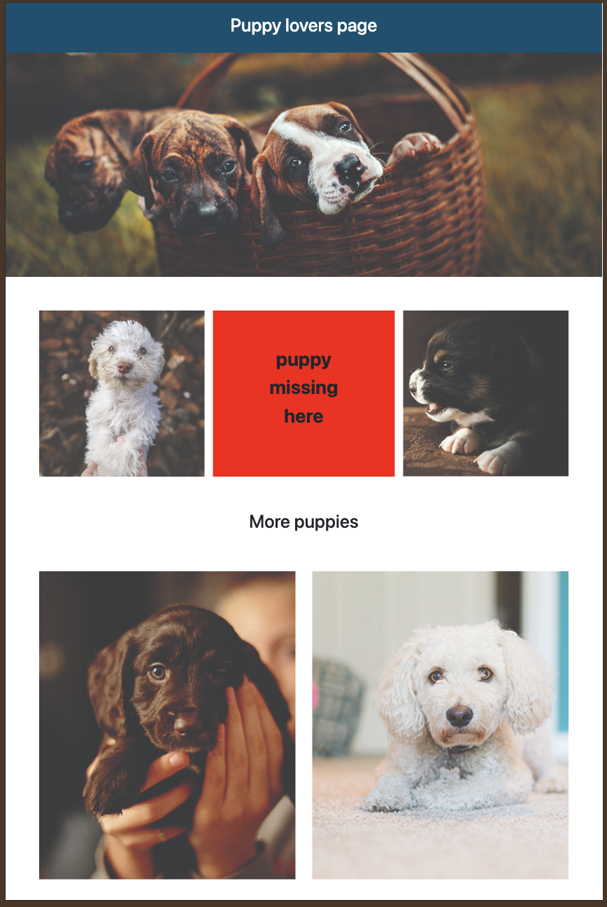
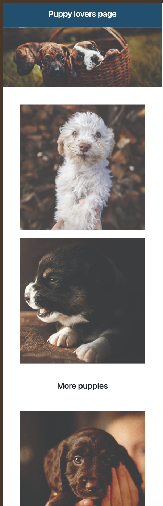

# Puppy Lovers Page

A simple and responsive static web page built with HTML, CSS, and Bootstrap, designed for puppy lovers. The page showcases cute puppy images arranged in a clean layout with a banner, image sections, and a footer.
## 📸 Preview

### Desktop View

### Mobile View

### Features

*  Responsive layout using Bootstrap grid system

+  Clean and simple UI

+ Image banner and gallery sections

+ Mobile-friendly design

+ Footer with developer credit
### Technologies Used

     HTML5

     CSS3

     Bootstrap
### How to Run the Project

1. Clone the repository:

git clone https://github.com/semira12/puppy-lovers-page.git

2. Navigate to the project folder:

        cd puppy-lovers-page

3. Open index.html in your browser:

+ Double-click the file
  or

+ Right-click → Open with browser

No server or installation needed
### What I Learned
+ Using Bootstrap’s grid system (row, col-md-*)

+ Building responsive layouts

+ Structuring a basic static website

+ Linking external CSS and JavaScript files

⚠️ Disclaimer

All images, logos, and trademarks belong to their respective owners.
This clone was built for educational purposes only.
